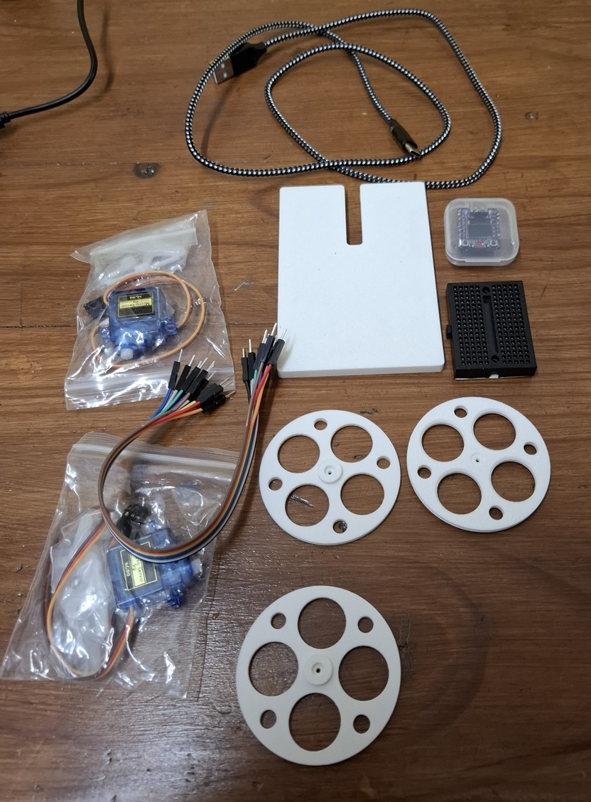

# 🐾 ESP32-C3 Mini Robot Tutorial  
### Using Continuous SG90 Micro Servos + `simple_esp` Robot Class

This tutorial shows how to build and program a very small robot using an **ESP32-C3**, two **continuous-rotation SG90 micro servos**, and a simple 3D-printed or cardboard chassis.

The robot is programmed entirely in **MicroPython** using the `Robot` class from the `simple_esp.py` library.

---

# 1. 🧰 What You Need



### Electronics
- **ESP32-C3 board** with soldered header pins
- **Two SG90 continuous-rotation 9g micro servos**
- **Mini breadboard**
- **Dupont Jumper wires** (male->male & male->female)
- **USB-C cable** for programming and power

These can all be cheaply purchased from Aliexpress.

### Mechanical parts
You can use **any** of these:

- **3D-printed chassis + wheels**  
- OR **stiff cardboard chassis** (prototype)  
- A **paperclip** for the front skid/caster
- **Sellotape / hot glue**
- **Wheels** (3D printed, Lego, cardboard circles, etc.)
- **Elastic bands** to keep wires tidy or extra grip on wheels

### Software
- **Thonny IDE** (https://thonny.org/)  
- MicroPython installed on the ESP32-C3  
- Files from the Python Code folder of this project uploaded to the board (`simple_esp.py`, etc.)

---

# 2. ⚡ Wiring the Robot

The robot uses two SG90 continuous-rotation servos. Normally, servos should **not** be powered directly from the ESP32-C3 because they can draw more current than the board can supply.  

However:

> ✔️ **Our robot is extremely lightweight**  
> ✔️ **Movement is only in short bursts**  
> ✔️ **SG90 servos draw very little current**  
>  
> So for this project, **direct 5V power is safe and works reliably**, but if it gets too big then you might find the ESP32-C3 reboots.

For larger robots, you would use **an external 5V battery pack** to connect to the 5V servo pins, with a **shared ground** to the ESP32-c3.

---

## 🔌 Connection Summary


### Breadboard Power
Each row of 5 holes on the mini-breadboard are connected to each other, so we can use this to connect multiple components to the same PIN on the esp32-c3. 
Connect the 5V GPIO PIN to one row - This will be the breadboard + rail. Connect the GD (Ground) GPIO PIN to another. This will be the breadboard - rail.
```
ESP32-C3 5V  → breadboard + rail
ESP32-C3 GND → breadboard – rail
```

### Servos
Each SG90 has three wires:

| Servo Wire | Connects To |
|------------|-------------|
| **Red**    | 5V (breadboard + rail) |
| **Brown**  | GND (breadboard – rail) |
| **Orange** | Signal pin |

### Signal Wiring
- **Left servo signal** → ESP32-C3 **Pin 0**  
- **Right servo signal** → ESP32-C3 **Pin 1**

You can power the ESP32-C3 with a USB powerbank, although these often shutdown automatically as they don't detect the small amount of current the ESP32-C3 draws when it is idle. You may want to connect an always on LED with resistor to the design to help keep it awake.
---

# 3. 🏗 Building the Chassis

### Option A — 3D Printed (final build)
- Servos slide into the chassis.
- Wheels push onto servo horns.
- ESP32-C3 sits on top.

### Option B — Cardboard Prototype
Surprisingly effective and very fast to build!

1. Cut a stiff cardboard rectangle.  
2. Tape the two servos on each side.  
3. Tape the breadboard on top.  
4. Tape the ESP32-C3 to the cardboard.  
5. Make a small slot for a **paperclip front skid wheel**.

It doesn’t need to look pretty — Scouts' prototypes were wonderfully creative.

---

# 4. 🧪 Testing Each Servo

Create **servo_test.py**:

```python
from simple_esp import Servo
import time

left = Servo(pin=0, stop_us=1500)
right = Servo(pin=1, stop_us=1500)

# Test left wheel
left.speed(1)
time.sleep(1)
left.stop()

time.sleep(1)

# Test right wheel
right.speed(1)
time.sleep(1)
right.stop()
```

Running this should make each wheel spin briefly.

---

# 5. 🤖 Programming Movement Using the Robot Class

Create **robot_test.py**:

```python
from simple_esp import Servo, Robot
import time

left = Servo(pin=0, stop_us=1500)
right = Servo(pin=1, stop_us=1500)

bot = Robot(left, right, speed=1)

bot.forward(1)
bot.left(0.5)
bot.right(0.5)
bot.backward(1)
```

### Fixing drift
If your robot veers left or right:

```python
bot = Robot(left, right, speed=1, calibrate=0.1)
```

Try between **–0.3** and **+0.3**.

---

# 6. 🎯 Programming Challenge for Scouts

We created a floor obstacle course:
- Tunnels  
- Parking bays  
- Tape mazes  
- Final goal zone  

Scouts had to tweak their Python code to navigate the course.

---

# 7. Remote controlling the Robot

When starting the robot app, it prompts for Bluetooth, Browser or None
Bluetooth allows the app to be controlled via the robot_control.py over BLE bluetooth

Browser allows the robot to be controlled over the web. The esp32-c3 will need to be configured to use Wifi via the wifi.py app first. The esp32-c3 will display an ip address similar to 192.168.1.123, depending on the configuration of your home wifi. Enter this address in a web browser on the same wifi network, and the bot can be controlled.

---
# 8. 🏁 Summary

By completing this project, Scouts learn:

- Basic servo wiring  
- How motor signals work  
- How to assemble a tiny robot  
- How to program forward/turn motions  
- How to use timing to measure distance  
- How to debug and adjust performance  

A perfect activity for the **Digital Maker** badge and a great introduction to robotics!
